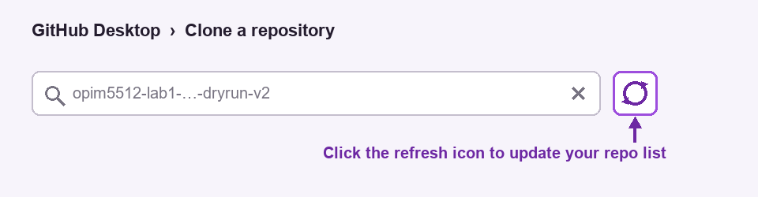

# Lab 1 instructions — OPIM 5512 (the GitHub Desktop walkthrough)

**OPIM 5512 · Module 1 · keep this open during the lab**

Every click you need tonight, in the order you'll need it. This is the *specific* path for this
lab — the general reference, with pictures, is
[github_fundamentals.md](../github_fundamentals.md).

> 🚫 **No AI tonight.** No Claude, no ChatGPT, no Copilot, no Colab autocomplete suggestions.
> Not because they're bad — Module 3 is an entire unit on using them — but because git is
> muscle memory, and you can't approve a partner's pull request you didn't actually read.
> Tonight is hands on keyboard. **Type it.**

---

## Before 5:30 — check these three things

1. **GitHub Desktop opens and you're signed in.**
   `File → Options → Accounts` (Windows) / `GitHub Desktop → Settings → Accounts` (Mac).
   You should see your username. If not, sign in now, not at 6:40.
2. **Git knows who you are.** Same Options window → **Git** tab. Name and email filled in.
   Use the email on your GitHub account or your commits won't link to you.
3. **colab.research.google.com opens** and you're signed into a Google account.

---

# Part 1 — Set up the repo (Partner A drives, 5:45)

Only **one** of you does this. Partner B watches over the shoulder — you'll need to know it
too, and there's no second repo to practice on.

### 1.1 Create it on github.com

Go to **github.com** → green **New** button (or the **+** at top right → New repository).

| Field | What to put |
|---|---|
| Repository name | `opim5512-lab1-<netidA>-<netidB>` |
| Description | "Weather and electricity demand — OPIM 5512 Lab 1" |
| **Public / Private** | ⚠️ **Public.** Colab reads your CSVs over a raw URL, and raw URLs don't work on private repos. There's nothing sensitive in here. |
| Add a README file | ✅ **check it** — you need at least one commit to exist before you can protect a branch |
| .gitignore template | **Python** — this tells git to skip Python junk (`__pycache__/`, `.ipynb_checkpoints/`, `venv/`) so it never lands in your repo or clutters a PR. It does **not** ignore `.csv`, so your cleaned data still commits fine. Free hygiene now, and it saves you when Module 2's assignment moves to a local virtual environment. |

Click **Create repository**.

### 1.2 Add your partner

**Settings** (tab across the top of the repo) → **Collaborators** in the left sidebar →
**Add people** → type their GitHub username → **Add to this repository**.

**Partner B: go check your email or your GitHub notifications and accept the invitation.**
Nothing works for you until you do. This trips up someone every single time.

### 1.3 Turn on branch protection

This is the rule that makes the whole night work: it means nobody — including you — can push
straight to `main`. Every change has to go through a pull request that the other person
approves.

**Settings** → **Rulesets** in the left sidebar → **New ruleset → New branch ruleset**.

- **Ruleset name:** `protect-main`
- **Enforcement status:** switch it to **Active** ← easy to miss, and it does nothing without this
- **Target branches:** **Add target → Include default branch**
- Under **Branch rules**, tick:
  - ✅ **Require a pull request before merging**
  - set **Required approvals** to **1**
  - **Block force pushes** — usually already checked by default; just leave it on

Click **Create**.

> 🧪 **Rehearsing solo? Then DON'T set Required approvals to 1** — leave it at **0**.
> That **Required approvals: 1** box is the two-person gate: it's exactly what stops you from
> approving your own pull request (GitHub won't let anyone approve their own PR). Great for a
> real pair, but with a single account it leaves you unable to merge. If you're testing the lab
> alone on one account, set **Required approvals to 0** so you can open *and* merge your own PRs
> (you can still leave *Comment* reviews to feel the flow). **For the real lab with students,
> keep it at 1** — the approval handshake is the whole point. (Rehearsing with two accounts is
> the other way to get real approvals without dropping the rule.)

> ⚠️ **Target the default branch only.** If you protect `[All branches]` you'll block your own
> `dev-` branches and nothing will push. If that happens tonight: it's a two-click fix, and
> honestly it's worth seeing once.

### 1.4 Both of you: get it onto your laptop

In **GitHub Desktop**: `File → Clone repository` → **GitHub.com** tab → find the repo in the
list → note the **Local path** (remember where it is, you'll be dragging files there) →
**Clone**.

If you don't see it, click the refresh icon (just right of the search box), and make sure
Partner B accepted the invite. A brand-new repo often doesn't appear until you refresh.



> **You clone ONCE.** The repo will look almost empty — just a README. That's correct, not a
> mistake: the clone is your empty workbench, and you're about to put things on it. You will
> **never clone this repo again.** After tonight you keep it current by **Fetch → Pull**, not by
> re-cloning.

> ### 🧭 How the two tools stay in sync (read this once)
> Tonight your work arrives through **two doors**: your **notebook** comes in through **Colab**
> (Save in GitHub → pushes straight to GitHub), and your **CSV + README** go in through **GitHub
> Desktop** (from your laptop). GitHub is the meeting point in the middle.
> The one habit that keeps them from fighting: **Pull in GitHub Desktop after Colab saves**, so
> your laptop matches what Colab just pushed. The whole night is:
> **clone once → work on a branch → open a PR → merge → Pull `main`.**

> ### 👀 "Why don't I see my files in GitHub Desktop?"
> Because GitHub Desktop's left panel shows **changes, not files** — only things you've edited
> since your last commit. When it says **"No local changes,"** that's the *good* state: your
> laptop and GitHub agree. Your files are still there. To actually *see* your files, use **Show
> in Explorer**, open the folder in **VS Code**, or browse the repo on **github.com**. The one
> time the left panel fills up is right after you change, add, or delete something — which is
> exactly when you want it to.

---

# Part 2 — Grab your data, then agree the contract (both — parallel, then together, 5:45–6:05)

First you'll **each open your own raw data and look at it**, on your own branch — Partner A and
Partner B at the same time, no waiting. *Then*, having actually seen the columns, the two of you
agree on what your output files look like and write it into the README as a **data dictionary**.
You can't name a column you haven't looked at.

This is the segment everybody wants to skip. Don't. The merge conflict you get at 6:50 is a
disagreement you're having *right now* and haven't noticed yet.

---

## What you're each starting from

**Partner A — the raw weather file.** Ten columns, and the names are aviation shorthand:

```
station            valid  tmpf  dwpf   relh  sknt   drct  p01i  vsby skyc1
    BDL 2026-07-20 00:51  65.0  51.0  60.49   5.0  340.0   0.0  10.0   CLR
    BDL 2026-07-20 01:51  60.0  51.0  72.13   4.0  330.0   0.0  10.0   CLR
    BDL 2026-07-20 02:51  60.0  51.0  72.13   0.0    0.0   0.0  10.0   CLR
```

| raw | what it is | unit |
|---|---|---|
| `station` | airport identifier | — |
| `valid` | observation time, **local**, at :51 past the hour | — |
| `tmpf` | air temperature | °F |
| `dwpf` | dew point | °F |
| `relh` | relative humidity | % |
| `sknt` | wind speed | **knots** |
| `drct` | wind direction | degrees |
| `p01i` | precipitation, past hour | inches |
| `vsby` | visibility | statute miles |
| `skyc1` | sky cover code | `CLR` / `FEW` / `BKN` / `OVC` |

**Partner B — the raw demand file.** Three usable columns, buried under row tags:

```
"C","Real-Time Hourly System Load Report"
"H","Date","Hour Ending","Total Load"
"H","Date","HE","MWh"
"D","07/20/2026","01",12158.9
"D","07/20/2026","02",11672.76
```

| raw | what it is | unit |
|---|---|---|
| `Date` | calendar date | — |
| `Hour Ending` | **1–24**, not 0–23 | — |
| `Total Load` | New England system demand | MW |

Neither of these is a set of names you'd want to live with. `tmpf` is fine for a pilot and
`Total Load` is fine for a report header, but `df["Total Load"]` is going to annoy you by
October. Renaming is your job.

---

## First: open your data on your branch (both, at the same time)

Do this in parallel — Partner A on `dev-weather`, Partner B on `dev-demand`. Different files,
different branches, so nothing collides.

**1. Make your branch.** In GitHub Desktop, top bar → **Current branch → New branch** →
- Partner A: `dev-weather`   ·   Partner B: `dev-demand`

→ **Create branch**, then **Publish branch** so it exists on GitHub too.

> 🔴 The most common mistake tonight is doing work while `main` is selected. Read the top bar —
> and read it again before every commit.
> ⚠️ Publish **before** you save from Colab: Colab's save dialog only lists branches that already
> exist on GitHub — it can't create one for you.

**2. Open your starter in Colab and LOOK at your data.** Open it straight from GitHub (the
**Open in Colab** badge on the notebook), or click your link — **open it in a new tab**
(Ctrl-click / Cmd-click, or right-click → *Open link in new tab*) so you keep these instructions
open beside Colab all night:
- **Partner A — weather:** [Lab1_A_Weather_Starter.ipynb](https://colab.research.google.com/github/drdave-teaching/OPIM5512-labs/blob/master/Module1/Week1_TechStack/Lab1_FirstCommit/notebooks/Lab1_A_Weather_Starter.ipynb)
- **Partner B — demand:** [Lab1_B_Demand_Starter.ipynb](https://colab.research.google.com/github/drdave-teaching/OPIM5512-labs/blob/master/Module1/Week1_TechStack/Lab1_FirstCommit/notebooks/Lab1_B_Demand_Starter.ipynb)
- *(the joint report starter, [Lab1_Joint_EDA_and_Report.ipynb](https://colab.research.google.com/github/drdave-teaching/OPIM5512-labs/blob/master/Module1/Week1_TechStack/Lab1_FirstCommit/notebooks/Lab1_Joint_EDA_and_Report.ipynb), comes later in Part 6)*

Set `CAMPUS` to your campus and run the **first cell** — the one that just reads and prints the
raw file. Actually look: the aviation column names, the `:51` timestamps, the `M`/`T` values, the
`Hour Ending 1–24`. **This is the data you're about to write a contract for.**

**3. Save the starter into your repo** → **File → Save a copy in GitHub**.
> ⚠️ Three things to get right in that dialog, every save:
> 1. **Repository** — scroll to **YOUR** repo (`opim5512-lab1-<netid>…`). Colab defaults to the
>    *class* repo (`OPIM5512-labs`); the list is long and not searchable, so hunt for yours.
> 2. **Branch** — your `dev-` branch (you published it in step 1, so it's in the dropdown).
> 3. **File path** — shorten it to `notebooks/<the starter's name>.ipynb` and use that **exact
>    same path every time**. A different path makes a second notebook, not an update.

**4. Pull in GitHub Desktop** (Fetch → Pull) so your laptop matches the notebook Colab pushed.

Now you've each got your branch, your starter, and — most important — *eyes on your raw data.*
Regroup for the contract.

---

## House style — use this

Every column in every file you make this semester:

- **lowercase**, `snake_case`, no spaces, no capitals
  → `df.temp_f` works; `df["Total Load"]` forces you to type brackets forever
- **put the unit in the name** when a reader could reasonably guess wrong
  → `temp_f` beats `temperature`. `wind_kt` beats `wind` — knots aren't mph and somebody
    *will* assume mph.
- **no unit in the name** when it can't be misread → `hour` is a timestamp, that's obvious
- **name the thing, not the source** → `load_mw`, not `isone_total_load_col3`

### One column, done properly

Here's a finished data dictionary entry. It's for `p01i` — a column **neither of you needs
tonight** — so you can copy the *format* without copying your answer:

> **`precip_in`** — precipitation recorded in the hour before the observation, in inches.
> Source: `p01i` in the raw METAR file. The raw file uses `T` for a **trace** — it rained, but
> less than 0.01 in. That's neither zero nor missing, and we had to decide: we treated `T` as
> missing, which slightly understates how many hours saw *some* rain. 34 of 744 hours are
> affected at KBDL.

Notice what that entry does: **name, meaning, unit, source, and what an odd value means.** All
five. The last two are the parts everybody forgets and the parts that save you later.

That entry also does the most important thing a data dictionary can do: **it admits a judgment
call.** Somebody reading your file six months from now can disagree with you — but only because
you told them. That's the whole job.

---

## The three decisions

Work through these together, out loud, before either of you opens Colab.

### 1. What do your columns get called?

Partner A has four or five to name, Partner B has one. Apply the house style. Write every name
into the README with a full dictionary entry, in the format above.

### 2. ⚠️ What does one row *mean*?

**This is the one that decides whether your join works.**

Partner A's observations are stamped `00:51`, `01:51`, `02:51`. Partner B's rows say
`Hour Ending 01`, `02`, `03`.

Those are two different clocks. Before you write code, answer this together:

> **If a row's timestamp says `2026-07-20 01:00`, does it describe the hour that just finished,
> or the hour that's about to start?**

Pick one, write the sentence into the README, and both build your `hour` column to mean
*exactly that*. Here is the convention this lab uses — and the one mechanical step it forces:

> ### ⚠️ `hour` = the hour that BEGINS. Partner B, subtract 1.
> ISO-NE ships **Hour Ending 1–24**. "HE 01" covers 00:00 → 01:00, so to put it on an
> hour-*begins* clock, **Partner B subtracts 1**:  HE 01 → `00:00`,  HE 02 → `01:00`,  …,
> HE 24 → `23:00`. (Subtracting also rescues HE 24, which is not a real clock hour and will
> otherwise crash your parse.)
>
> **Partner A** floors each `:51` observation down to the hour:  `06:51` → `06:00`.
>
> Do both and your two clocks line up. Skip either and the 7:00 join returns **0 rows**.

```python
# Partner B — ISO-NE Hour Ending 1-24  →  hour that BEGINS
demand["hour"] = pd.to_datetime(demand["date"]) + pd.to_timedelta(demand["he"] - 1, unit="h")

# Partner A — observation at :51  →  hour that BEGINS
weather["hour"] = pd.to_datetime(weather["valid"]).dt.floor("h")
```

> 🔑 **What the lab fixes for you, so you can spend the time on what matters:**
> the timestamp column is called **`hour`** in both files, and the files are called
> **`data/clean/weather_hourly.csv`** and **`data/clean/demand_hourly.csv`**. Keys and paths
> are the kind of thing real teams standardize once and stop arguing about.
>
> **Everything else is yours** — every other column name, and, crucially, *what `hour` means*.
> That last one is the decision that matters.

Get this wrong and your merge returns **0 rows** at 7:00. That is a completely recoverable
mistake and an extremely memorable one.

### 3. What happens to a missing hour?

The airport occasionally skips an observation, so Partner A will have slightly fewer than 744
rows. Decide now: **drop that hour, or keep the row with a blank temperature?**

Either answer is defensible. An undocumented answer is not. Whichever you choose, say so in the
dictionary — and Partner B should know, because it changes what the join returns.

---

## Copy this into your README

Don't hand-build a table. Copy your half below straight into `README.md`, then fill the blanks
(`____`) with the decisions you just made. The fixed cells (`hour`, `load_mw`, file names) are
already standardized for you.

**Partner A — paste this:**

```markdown
## Data Dictionary

### data/clean/weather_hourly.csv  (Partner A)
| column       | meaning                                          | units |
|--------------|--------------------------------------------------|-------|
| hour         | timestamp — the hour that BEGINS                 | —     |
| temp_f       | air temperature                                  | °F    |
| dewpoint_f   | dew point                                        | °F    |
| humidity_pct | relative humidity                                | %     |
| wind_kt      | wind speed                                        | knots |

**Convention:** `hour` is the hour that BEGINS. Weather is floored from the :51 observation.
**Missing hours:** ____ (drop the row, or keep it blank? — write which).
```

**Partner B — paste this under the same `## Data Dictionary` heading:**

```markdown
### data/clean/demand_hourly.csv  (Partner B)
| column   | meaning                                   | units |
|----------|-------------------------------------------|-------|
| hour     | timestamp — the hour that BEGINS          | —     |
| load_mw  | New England system demand for that hour   | MW    |

**Convention:** `hour` is the hour that BEGINS. ISO-NE ships Hour Ending 1–24, so **subtract 1**
(HE 01 → 00:00).
```

> You're both writing under the **same `## Data Dictionary` heading**, on your own branches.
> That's deliberate — it's what makes the merge collide in Part 5. Good.

---

## Write your half — on your branch

Each of you writes **your half** of the data dictionary into `README.md`, on the same `dev-`
branch you made above. Copy the stub from *"Copy this into your README"* and fill it in.

**Don't open a pull request yet.** Your README edit rides on the same branch as your notebook and
(next) your CSV — you'll open **one** pull request at the end of Part 3 with all three together.

Yes, you're both editing the same README section. Yes, it collides when the second PR merges.
That's Part 5, and it's on purpose.

---

# Part 3 — Clean it, then open your one pull request (each on your branch, 6:05–6:40)

You already have your branch, your starter, and your half of the README contract on it (Part 2).
Now finish the analysis and ship all three in **one** pull request. This is the core cycle —
you'll do it hundreds of times in your career.

### 3.1 Clean your data in Colab

Back in the starter you opened in Part 2, finish cleaning your half and produce your CSV. When
it's ready, two things leave Colab, and they leave *differently*:

- **The notebook** → **File → Save a copy in GitHub** again — **same repo, same branch, same
  path** as before, so it *updates* your notebook instead of making a new one.
- **The CSV** → download it (it lands in your Downloads folder); you'll drag it into the repo next.

Full details, both directions, in [COLAB_AND_GITHUB.md](COLAB_AND_GITHUB.md). Come back when the
CSV is in your Downloads folder.

### 3.2 Put your CSV in the repo

Open your repo folder on disk (the Local path from step 1.4). Make a folder called `data`, and
inside it one called `clean`. Drag your downloaded CSV in:

- Partner A → `data/clean/weather_hourly.csv`
- Partner B → `data/clean/demand_hourly.csv`

### 3.3 Commit

Switch to GitHub Desktop. It noticed. The **Changes** tab on the left now lists your file.

1. **Click the filename** and actually look at the diff on the right. For a new CSV you'll see
   green lines — your data. *Look at it.* This is the habit: never commit something you
   haven't looked at.
2. Bottom left, write a **Summary**. A real one:
   - ✅ `Add cleaned hourly weather for KBDL, Jul 20 - Aug 19`
   - ❌ `update`, `stuff`, `asdf`
3. Click **Commit to `dev-weather`** (it names your branch on the button — read it).
4. Click **Push origin** in the top bar.

### 3.4 Open your one pull request

Your branch now carries all three: your **notebook**, your half of the **README contract**, and
your **CSV**. Time for a single PR that covers the lot.

After pushing, Desktop shows a blue banner: **Create Pull Request**. Click it — it opens
github.com.

- Check the arrow at the top: it should say **base: main ← compare: dev-weather**
- Title: what you did
- Description: what your partner should look at. *"Check my column names against the contract"*
  is a great PR description.
- **Create pull request**

Now tell your partner. Out loud. They're sitting next to you (or on the call).

---

# Part 4 — The ping-pong (6:40–6:55)

Both PRs are open at once. You review theirs, they review yours.

### 4.1 Review your partner's PR

On github.com, open **their** pull request → the **Files changed** tab.

Read it. Actually read it. Then click **Review changes** (top right) and pick one — you must
pick one:

| | When |
|---|---|
| **Comment** | you have a question but aren't blocking |
| **Approve** | you read it and it's good |
| **Request changes** | something's wrong — say specifically what |

Write a sentence. "Looks good" is not a review. Try *"column names match the contract, and I
like that you kept the missing hour instead of dropping it."*

→ **Submit review**

Three mechanics that trip everyone the first time:

- To comment on a **specific line**, hover it and click the blue **+**. Then choose **Start a
  review** (batches your comments into one notification), *not* **Add single comment** (which
  emails your partner once per comment).
- **Only Approve unlocks the merge.** A "Comment" review feels like participating, but your
  partner stays blocked with no visible reason. If it's good, say Approve.
- **Approving with small suggestions is normal.** The choice isn't "perfect" or "Request
  changes" — you can approve *and* note two nits in the same review. Save Request changes for
  things that are actually wrong.
- One thing GitHub enforces for you: **you can't review your own PR.** That's why this lab
  needs two of you.

### 4.2 Merge

Once your partner has approved *your* PR, go to your PR → **Merge pull request** → **Confirm
merge** → **Delete branch** (the button appears right after; take it).

If the merge button is greyed out, you don't have an approval yet. That's branch protection
doing its job.

### 4.3 Both of you: come home to main

In GitHub Desktop:
1. **Current branch** → **main**
2. **Fetch origin**
3. **Pull origin**

Now look in `data/clean/`. **Both files are there.** Neither of you could have gotten here
alone — that's the point of the last hour.

One piece of housekeeping while you're here: your merged branch still exists on your laptop
even though you deleted it on github.com — branches live in two places. In GitHub Desktop:
**Branch menu → Delete** (it will only offer this for branches that are safely merged).
Deleting a merged branch never deletes work: the branch is a sticky note pointing at commits
that now live in `main`. Short-lived branches are the habit — make one, merge it, delete it.

### 4.5 — You got "Request changes." Now what?

This is the part nobody tells you, so read it now, before it happens.

1. **Do NOT open a new pull request.** Fix it on the *same branch*.
2. Make the fix (in Colab or locally), commit, push — exactly like Part 3.
3. **Your PR updates itself.** Same PR number, new commit, the diff refreshes. A pull request
   tracks a *branch*, not a snapshot — anything you push to that branch is automatically part
   of the request.
4. Reply on the **Conversation** tab — one line saying what changed.
5. **Re-request review**: in the Reviewers box (right side), click the **⟳** next to your
   partner's name. Without this they never get pinged.
6. ⚠️ **The red "Changes requested" badge does NOT clear when you re-request.** It stays red
   until your partner submits a *new* approving review. Red does not mean your fix failed —
   it means they haven't re-reviewed yet. Don't start over.

And the mirror, for the reviewer: after you submit "Request changes," **you** are the one
blocking the merge. Watch for the re-request so your partner isn't stuck waiting on you.

---

# Part 5 — The merge conflict (it's on purpose)

You both edited the data dictionary in `README.md`. Whoever merges second gets this:

```
This branch has conflicts that must be resolved
```

**Don't panic and don't start over.** Here's the fix, in Desktop:

1. **Current branch → main**, then **Fetch** and **Pull** so you have your partner's version
2. **Current branch → your branch**
3. **Branch → Update from main**
4. Desktop says there's a conflict and offers **Open in editor** — do that

You'll see this in the file:

```
<<<<<<< HEAD
temp_f: hourly temperature at the airport, degrees Fahrenheit
=======
temperature: air temp (F) from the METAR observation
>>>>>>> main
```

Top block is yours. Bottom block is theirs. **Decide together what the line should say** — it
can be either one, or a third thing you write — then **delete all three marker lines**
(`<<<<<<<`, `=======`, `>>>>>>>`). Save.

Back in Desktop: the conflict warning clears → **Continue merge** → commit → **Push**. Your PR
updates itself and the merge button comes back.

> That conflict wasn't a git problem. It was the two of you naming the same column two
> different ways, and git refusing to guess which one was right. Fixing it took thirty seconds.
> Finding it in November, inside a broken model, would have taken an afternoon.

---

# Part 6 — The report (7:20ish)

Same loop one last time, together this time. Whoever's driving:

1. New branch: `report`
2. Add `REPORT.md` and your `figures/` folder to the repo on disk
3. Commit → Push → Create Pull Request
4. Your partner reviews it — and for a written report, "request changes" is a completely
   normal and useful thing to do
5. Merge, delete branch, pull `main`

---

## Show your work: the network graph

On github.com: **Insights** tab → **Network** in the sidebar.

You should see a picture of tonight: `main` running along, two branches peeling off and
rejoining, then another. **That graph is the deliverable.** It's proof that two people worked
in one repo without breaking each other, and it can't be faked by one person doing everything.

---

## When something goes wrong

| What you see | What it means | What to do |
|---|---|---|
| Push rejected, "protected branch" | you're on `main` | Check the top bar. Make a branch, commit there. |
| Merge button greyed out | no approval yet | Your partner has to approve. Ask them. |
| Partner can't see the repo | invite not accepted | Check GitHub notifications / email |
| `raw.githubusercontent.com` 404 in Colab | repo is private, or wrong branch in the URL | Make it public; check `main` vs your branch |
| Desktop shows 300 changed files | you committed `__pycache__` or `.ipynb_checkpoints` | Add them to `.gitignore`, then `Repository → Repository settings` |
| "Changes" is empty but you saved the file | you saved it outside the repo folder | Check the Local path from step 1.4 |
| You committed to the wrong branch | happens to everyone | **Don't** try to undo it. Ask Dave — it's a 20-second fix and worth watching once. |

> **The one thing not to do:** don't delete the folder and re-clone to escape a problem. You'll
> lose work, and the problem is almost always two clicks. Ask instead — that's what the room is
> for tonight.
