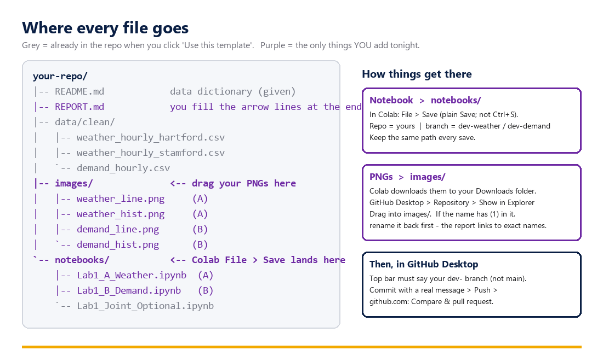

# Lab 1 instructions — simple edition (OPIM 5512)

**Module 1 · keep this open during the lab.** Every click you need tonight, in the order you need it.
The data is already clean. Tonight is about the **workflow**: branch → commit → push → pull request → review → merge.

> 🚫 **No AI tonight.** Your only coding task is a three-line histogram. Type it. Module 3 is the AI unit.



---

## Before 5:30 — check three things

1. **GitHub Desktop opens and you're signed in.** `File → Options → Accounts` (Windows) / `GitHub Desktop → Settings → Accounts` (Mac). You should see your username.
2. **colab.research.google.com opens** and you're signed into a Google account.
3. **You know your campus word:** `hartford` or `stamford`.

---

# Part 1 — Set up the shared repo (Partner A drives, ~10 min)

Only **one** of you does this. Partner B watches — you'll need to know it too.

### 1.1 Make the repo from the template
Open **https://github.com/drdave-teaching/opim5512-lab1-template** → green **Use this template** → **Create a new repository**.

| Field | What to put |
|---|---|
| Owner | **you** (your personal account) |
| Repository name | `opim5512-lab1-<netidA>-<netidB>` |
| Visibility | **Public** (raw file links need it; there's nothing secret) |

Click **Create repository.** You now have a repo that already contains the cleaned data, both notebooks, an empty `images/` folder, a README with the data dictionary, and a `REPORT.md` skeleton. **You did not have to make any of that.** Look at the picture above — grey is what you got.

### 1.2 Add your partner
Repo **Settings → Collaborators → Add people** → type Partner B's GitHub username → **Add**.
**Partner B:** accept the invite — check your email, or the 🔔 bell on github.com. Until you accept, you can't push.

### 1.3 Protect `main`
Repo **Settings → Rules → Rulesets → New ruleset → New branch ruleset**:
- Name: `protect main` · Enforcement: **Active**
- Target branches → **Add target → Include default branch**
- Rules: ✅ **Require a pull request before merging** → **Required approvals: 1**
- Leave *Block force pushes* checked (it usually is) → **Create**

This is the two-person gate: from now on nothing lands on `main` without your partner's approval, and **you can't approve your own pull request.**
*(Rehearsing solo with one account? Set Required approvals to **0**.)*

### 1.4 Both partners: clone it — once
**GitHub Desktop → File → Clone repository → GitHub.com tab** → find the repo (click the 🔄 refresh icon if it's not listed yet) → note the **Local path** → **Clone**.

> This is the *only* time you clone. From here on, GitHub Desktop **Pull**s new work down and **Push**es yours up.
> The **Changes** panel shows *what changed*, not your files — to *see* files, use **Repository → Show in Explorer**.

### 1.5 Each partner: make your branch
**Current branch → New branch** → name it **`dev-weather`** (A) / **`dev-demand`** (B) → **Create branch** → **Publish branch** (the button top-right, or the big card in the middle).

> 🔴 Read the top bar before every commit tonight. If it says **`main`**, stop and switch.

---

# Part 2 — Plot & ship (each partner, on your own branch, ~30 min)

### 2.1 Open *your* notebook in Colab, from *your* repo
**colab.research.google.com → File → Open notebook → GitHub tab** → paste your repo URL (e.g. `https://github.com/<you>/opim5512-lab1-…`) → press Enter → click
`notebooks/Lab1_A_Weather.ipynb` (Partner A) or `notebooks/Lab1_B_Demand.ipynb` (Partner B).

Open it in its **own tab** so these instructions stay open beside it.

### 2.2 Run it
- **Partner A:** set `CAMPUS = "hartford"` or `"stamford"` in the first cell.
- **Runtime → Run all.** The setup loads the clean data and the **line plot** appears — it already saved a PNG. Read the short "how this was cleaned" note while it runs; that's your data dictionary.

### 2.3 Write your histogram (the one thing you code)
In the cell marked **TODO**, write the histogram. The shape is printed right above it — roughly:

```python
ax = wx["temp_f"].plot.hist(bins=20, figsize=(8, 4), title="Most hours sit in the 60s and 70s")
ax.set_xlabel("temperature (F)")
ax.get_figure().savefig("weather_hist.png", dpi=150, bbox_inches="tight")
```

(Partner B: `dem["load_mw"]` → `demand_hist.png`.) Run it. **Look at it.** Retitle it with what a reader should notice. Keep the filename **exactly** as given — the report links to it.

### 2.4 Download the two PNGs
Run the **download** cell. Two files land in your **Downloads** folder. If it says a file isn't found yet, run the cell that makes it (your histogram) and re-run.

### 2.5 Save the notebook back to GitHub (File → Save)
In the Colab menu: **File → Save.** (There is no "Save a copy in GitHub" item — plain **Save** commits to GitHub because you opened it *from* GitHub. **Ctrl+S alone only autosaves to Drive.**) In the dialog:

1. **Repository** — scroll to **your** repo (the list is long and not searchable).
2. **Branch** — your `dev-` branch.
3. **File path** — leave it as `notebooks/Lab1_A_Weather.ipynb` (or `…B_Demand…`). **Same path every time**, or you create a second notebook.
4. **Commit message** — a real one: `add temperature histogram`.

> 💡 Prove it worked once: add `#TEST` at the top, save, refresh the file on github.com — you'll see it. Then change it to `#TEST2`, save again, and watch it **update in place**. Each save is a snapshot; editing more means saving again.

### 2.6 Drag the PNGs into the repo
**GitHub Desktop → Repository → Show in Explorer** (Reveal in Finder on Mac). That's your repo folder. Drag both PNGs from **Downloads** into the **`images/`** folder.

> ⚠️ If a filename shows **`(1)`** or **`(2)`** — Downloads renamed it because you downloaded twice — **rename it back** to the exact name before dragging. `REPORT.md` links to the exact names.

### 2.7 Commit and push
Back in **GitHub Desktop**: the two PNGs are under **Changes**. Confirm the top bar says **your `dev-` branch**. Bottom-left: **Summary** = `add weather plots` → **Commit to dev-weather** → **Push origin**.

If it says **Pull origin** first — that's your Colab save waiting to come down. Click it, then Push.

---

# Part 3 — Review & merge (both, ~20 min)

### 3.1 Open your pull request
On github.com your repo shows a yellow bar: **Compare & pull request** → check it's **`dev-weather` → `main`** → title `Weather plots` → **Create pull request** → right side, **Reviewers** → your partner.

### 3.2 Review your partner's
Open your **partner's** PR → **Files changed**. Actually read it: their histogram cell (does the title say something? units on the axis?) and their two PNGs. Then **Review changes → Approve → Submit review.** Leave one real comment if you have one.

### 3.3 Merge, delete, pull
- **Merge pull request → Confirm** → **Delete branch.** Both PRs.
- **Both partners:** GitHub Desktop → **Current branch → `main` → Fetch origin → Pull origin.** Open `images/` in Explorer: **four PNGs.** Neither of you could have produced that alone.

---

# Part 4 — The report (one screen, two people, ~20 min)

### 4.1 Fill in `REPORT.md`
On github.com, open **`REPORT.md`** → ✏️ **Edit.** The four plots already render. Replace each **➜** line with **one sentence** — every number gets a unit (°F, MW, hours). Add one honest sentence under *What this data can't tell us*.

### 4.2 It goes through a pull request too
**Commit changes…** → choose **Create a new branch for this commit and start a pull request** → branch name `report` → **Propose changes** → **Create pull request** → the *other* partner **approves** → **Merge** → delete branch. `main` is protected — that's the rule working, not a bug.

### 4.3 If you're ahead: the joint plot
Open `notebooks/Lab1_Joint_Optional.ipynb` the same way, run it → download `temp_vs_load.png` → drag into `images/` → commit on a branch → PR → merge. It drops into section 5 of the report. Chase the question at the bottom of that notebook — it's the surprise.

### 4.4 Read-out
One plot on the screen, one sentence. Then **Insights → Network** on your repo: the branches leaving `main` and coming back are your night.

---

## When it breaks

| Symptom | Fix |
|---|---|
| Push rejected on `main` | You're on `main`. Switch to your `dev-` branch and commit there. The rejection is the protection working. |
| "Where's *Save a copy in GitHub*?" | It doesn't exist. Plain **File → Save**. |
| Saved but GitHub didn't change | You hit Ctrl+S (Drive autosave). **File → Save**, and re-save after each edit. |
| Can't pick my branch in the Colab save dialog | It only lists *existing* branches. Make it in GitHub Desktop first (1.5), then save. |
| Report shows a broken image | Filename mismatch — usually a `(1)` in the PNG name, or it's in the wrong folder. Exact name, in `images/`. |
| Deleted a branch by mistake | Merged PRs have a **Restore branch** button. Committed work is very hard to lose. |
| Fetch/Pull will overwrite my work? | No. Fetch peeks, Pull downloads. The scary buttons are the *Discard* ones. Commit first and you're safe. |

*Extended edition (you clean the data, and stage a merge conflict on purpose): one folder up, [Lab1_instructions_opim5512.md](../Lab1_instructions_opim5512.md).*
