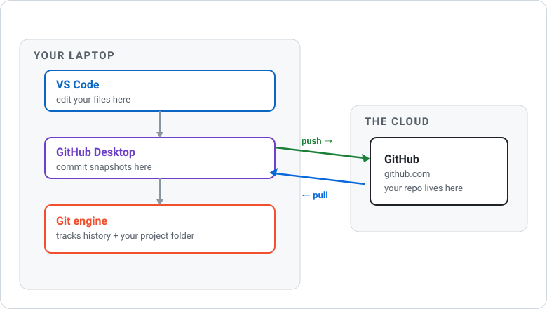
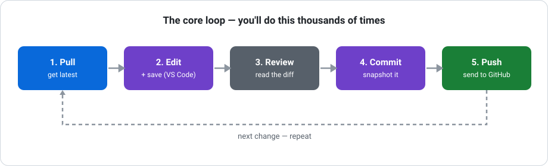
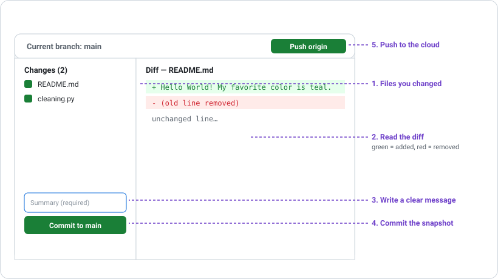
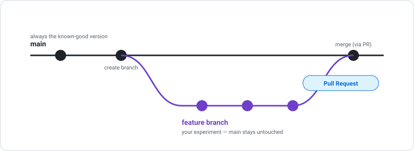
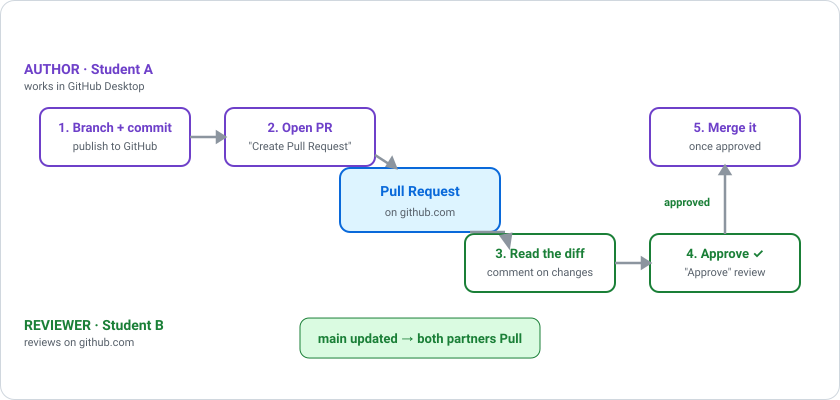
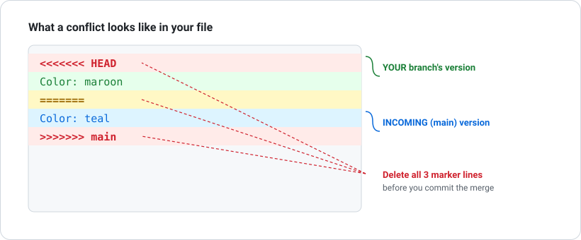

# GitHub Fundamentals — Your First Real Workflow

**OPIM 5512 · Dr. Dave Wanik · University of Connecticut**

> **Who this is for:** You've never used Git, GitHub, or GitHub Desktop, and VS Code still feels new. Perfect. This guide assumes zero prior knowledge and walks you through the exact moves you'll repeat for the rest of your career.

> **How to use this guide:** Don't just read it — *do it* as you go. Every section with a 🛠️ **Your turn** box is a checkpoint. If you can do every checkpoint without peeking, you've got the fundamentals.

---

## Table of contents

1. [The mental model (read this first)](#1-the-mental-model-read-this-first)
2. [One-time setup](#2-one-time-setup)
3. [Get a repo onto your machine (clone)](#3-get-a-repo-onto-your-machine-clone)
4. [The core loop: edit → commit → push](#4-the-core-loop-edit--commit--push)
5. [Pull before you work](#5-pull-before-you-work)
6. [Reading history and diffs](#6-reading-history-and-diffs)
7. [What NOT to commit (.gitignore)](#7-what-not-to-commit-gitignore)
8. [Branches](#8-branches)
9. [Pull requests](#9-pull-requests)
10. [Issues: tracking work to be done](#10-issues-tracking-work-to-be-done)
11. [Lab: the ping-pong (collaborate and approve with a buddy)](#11-lab-the-ping-pong-collaborate-and-approve-with-a-buddy)
12. [Merge conflicts (don't panic)](#12-merge-conflicts-dont-panic)
13. [When things go wrong](#13-when-things-go-wrong)
14. [Cheat sheet](#14-cheat-sheet)

---

## 1. The mental model (read this first)

Ninety percent of beginner confusion comes from mixing up four tools that all sound similar. Get these straight and everything else clicks.

| Tool | What it is | Plain-English analogy |
|------|-----------|----------------------|
| **Git** | The version-control *system*. It tracks every change to your files over time. | The "track changes" engine — invisible, always running under the hood. |
| **GitHub** | A website that stores Git projects *in the cloud* so you (and others) can access them anywhere. | Google Drive, but built for code. |
| **GitHub Desktop** | A free app that lets you use Git by clicking buttons instead of typing commands. | The friendly steering wheel for the Git engine. |
| **VS Code** | The editor where you actually write and change files. | Your word processor. |

Here's how they fit together:



Three words you'll use constantly:

- **Repository ("repo")** — a project folder that Git is tracking. It's just a normal folder with a hidden `.git` history inside it.
- **Commit** — a saved snapshot of your work with a short message describing what changed. Think of it as a labeled save point you can always return to.
- **Push / Pull** — *push* uploads your commits to GitHub; *pull* downloads everyone else's commits to your machine.

> 💡 **The one-sentence version:** You *edit* in VS Code, *commit* snapshots in GitHub Desktop, and *push* them to GitHub so they're safe in the cloud.

---

## 2. One-time setup

You only do this once per computer.

### 2.1 — Make a GitHub account
- Go to <https://github.com> and sign up.
- Use your **UConn email** and your **netID as your username** (e.g., `dww05002`).

### 2.2 — Install the tools
- **GitHub Desktop** → <https://desktop.github.com>
- **VS Code** → <https://code.visualstudio.com>
- **Git** comes bundled with GitHub Desktop, so you don't need a separate install to start. (If you want the terminal commands to work too, install Git from <https://git-scm.com/downloads>.)

### 2.3 — Sign in to GitHub Desktop
1. Open GitHub Desktop.
2. **File → Options → Accounts → Sign in** (Windows), or **GitHub Desktop → Settings → Accounts** (Mac).
3. Sign in with the GitHub account you just made. This connects the app to your cloud account so pushing "just works" — no passwords or tokens to fumble with.

### 2.4 — Tell Git who you are
GitHub Desktop usually fills this in from your account, but confirm it:
- **Options/Settings → Git** — make sure **Name** and **Email** are set (use the same email as your GitHub account).

<details>
<summary>🖥️ <strong>Same thing in the terminal</strong> (optional — you can skip this all year and be fine)</summary>

```bash
git config --global user.name "dww05002"
git config --global user.email "you@uconn.edu"
git config --global --list      # confirm it stuck
```
</details>

🛠️ **Your turn:** Open GitHub Desktop and confirm you're signed in (your username shows under Accounts). ✅

---

## 3. Get a repo onto your machine (clone)

**Cloning** = downloading a full copy of a GitHub repo to your laptop, history and all. You'll do this for the class labs repo and for your own personal repo.

### Option A — Clone *your own* repo (you'll create this in Week 1 setup)
1. On GitHub, create a repo named `opim5512-<your-netid>` (private, "Add a README").
2. In **GitHub Desktop → File → Clone repository → GitHub.com** tab.
3. Pick your repo from the list.
4. Choose a **local path** — I recommend `C:\Users\<you>\code\` on Windows or `~/code/` on Mac. **Avoid OneDrive/iCloud folders** — cloud-sync apps fight with Git and cause weird errors.
5. Click **Clone**.

### Option B — Clone the class labs repo (to follow along)
Same steps, but in the Clone dialog use the **URL** tab and paste the labs repo URL Dr. Dave gives you.

<details>
<summary>🖥️ <strong>Same thing in the terminal</strong></summary>

```bash
cd ~/code                                              # the folder you want it in
git clone https://github.com/<you>/opim5512-<netid>.git
cd opim5512-<netid>
```
</details>

🛠️ **Your turn:** Clone your personal repo. Then click **"Open in Visual Studio Code"** in GitHub Desktop — VS Code should open the folder. You now have the same project in three places: your laptop, GitHub Desktop, and VS Code. ✅

---

## 4. The core loop: edit → commit → push

**This is the single most important section.** You will do this loop thousands of times. Everything else is a variation on it.



Here's the GitHub Desktop window you'll be working in — the four numbered spots are exactly the steps below:



### Step 1 — Edit
In VS Code, open `README.md` and add a line:

```
Hello World! My favorite color is teal.
```

Save the file (**Ctrl/Cmd + S**). *Unsaved changes don't exist as far as Git is concerned* — always save first.

### Step 2 — Review the diff
Switch to GitHub Desktop. On the left you'll see **Changes** — `README.md` is listed. On the right, the **diff**:
- **Green / `+`** lines = what you added
- **Red / `-`** lines = what you removed

> 🔍 **Build the habit of actually reading the diff before every commit.** It's how you catch mistakes — a stray file, a debug line you forgot to delete, a password you didn't mean to save.

### Step 3 — Commit
At the bottom-left of GitHub Desktop:
1. **Summary** box → write a short, present-tense message: `Add hello world line to README`
2. Click **Commit to main**.

You just created a save point. It's on your laptop — but **not yet on GitHub**.

#### What makes a good commit message?
A future you (and your teammates) will read these. Good messages describe *what changed and why*, not "stuff" or "asdf".

| ❌ Weak | ✅ Strong |
|---------|----------|
| `update` | `Fix off-by-one error in date filter` |
| `changes` | `Add boston housing regression notebook` |
| `asdf` | `Remove unused import in cleaning script` |

**Rule of thumb:** finish the sentence *"If applied, this commit will ___."* → "...add hello world line to README." ✅

### Step 4 — Push
Click **Push origin** (top of GitHub Desktop). *Now* it's in the cloud.

Refresh your repo on github.com — your change is there. 🎉

<details>
<summary>🖥️ <strong>Same thing in the terminal</strong></summary>

```bash
git status                          # see what changed
git add README.md                   # stage the file
git commit -m "Add hello world line to README"
git push                            # send to GitHub
```
The four-step loop maps exactly: edit → `git add` → `git commit` → `git push`.
</details>

🛠️ **Your turn:** Make a change, review the diff, commit with a clear message, and push. Confirm it appears on github.com. **You'll know you've got the fundamentals when this loop feels boring.** ✅

---

## 5. Pull before you work

When you work with others (or on two computers), GitHub's copy can get *ahead* of your laptop's copy. **Pulling** downloads those changes so you're up to date.

> ⛑️ **Golden rule: pull before you start working each session.** It's the single best habit for avoiding the conflicts in Section 12.

In GitHub Desktop:
- Click **Fetch origin** (top bar). If there are new changes, the button becomes **Pull origin** — click it.

<details>
<summary>🖥️ <strong>Same thing in the terminal</strong></summary>

```bash
git pull
```
</details>

🛠️ **Your turn:** Click **Fetch origin** now. If it says everything's up to date, great — that's the normal, healthy state. ✅

---

## 6. Reading history and diffs

Git's superpower is that nothing is ever truly lost. Every commit is recoverable.

In GitHub Desktop, click the **History** tab (next to Changes):
- Each row is a commit: message, author, and time.
- Click any commit to see exactly what changed in it.

On GitHub.com you can do the same: open any file → **History** button, or **Blame** to see who last touched each line and why.

<details>
<summary>🖥️ <strong>Same thing in the terminal</strong></summary>

```bash
git log --oneline        # compact list of commits
git log -p README.md     # full history of one file, with diffs
git show <commit-id>     # everything that changed in one commit
```
</details>

🛠️ **Your turn:** Open History and find your "hello world" commit. Click it and read the diff. That snapshot will be there forever. ✅

---

## 7. What NOT to commit (.gitignore)

Not everything belongs in Git. Commit your **code and small text files**. Do **not** commit:

| Don't commit | Why |
|--------------|-----|
| `.venv/` virtual environments | Huge, machine-specific, easily rebuilt from `requirements.txt`. |
| Large data files (`*.csv` over a few MB) | Bloats the repo forever; Git isn't built for big binary data. |
| Secrets — API keys, passwords, `.env` files | **Once pushed, treat a secret as compromised** even if you delete it. The history keeps it. |
| `.ipynb_checkpoints/`, `__pycache__/` | Auto-generated junk. |

A **`.gitignore`** file tells Git "pretend these don't exist." This repo already has one. A typical Python `.gitignore` includes:

```gitignore
.venv/
__pycache__/
*.pyc
.ipynb_checkpoints/
.env
data/*.csv
```

> 🔑 **If you ever see your `.venv` folder or a giant data file show up in GitHub Desktop's Changes list, stop.** Add it to `.gitignore` *before* you commit. Keeping it out is easy; removing it after it's in the history is a pain.

🛠️ **Your turn:** Open `.gitignore` in VS Code and read it. Notice the entries match the junk you'd otherwise commit by accident. ✅

---

## 8. Branches

So far you've worked directly on the **`main`** branch — the official version. A **branch** is a parallel copy where you can experiment *without touching `main`*. When the work is good, you merge it back in.

**Why bother?** It lets you (and teammates) work on different things at once without stepping on each other, and keeps `main` always working.



In GitHub Desktop:
1. **Current branch** dropdown (top) → **New branch**.
2. Name it something descriptive: `add-eda-notebook` (no spaces; use dashes).
3. Click **Create branch**. You're now *on* that branch — commits go here, not to `main`.
4. Do your edit → commit loop as usual.
5. **Publish branch** to push it to GitHub.

<details>
<summary>🖥️ <strong>Same thing in the terminal</strong></summary>

```bash
git switch -c add-eda-notebook    # create and switch to the branch
# ...edit, commit as usual...
git push -u origin add-eda-notebook
```
To move between branches: `git switch main` / `git switch add-eda-notebook`.
</details>

🛠️ **Your turn:** Create a branch called `practice-branch`, make a small commit on it, and publish it. Then switch back to `main` in the dropdown and notice your change *disappears* from the files — because it lives on the other branch. Switch back and it returns. That's branching. ✅

---

## 9. Pull requests

A **pull request (PR)** is how you propose merging your branch into `main`. It's a request that says *"here's my work — review it, then pull it in."* On teams, PRs are where code review and discussion happen. Even solo, they're a clean record of what changed and why.

1. After you **publish** a branch, GitHub Desktop shows a **"Create Pull Request"** button — click it (it opens github.com).
2. On GitHub, give the PR a title and description (what you changed, why).
3. Click **Create pull request**.
4. Review the diff. When you're happy, click **Merge pull request** → **Confirm merge**.
5. Your branch's work is now part of `main`.

After merging, go back to GitHub Desktop, switch to `main`, and **Pull** — so your laptop picks up the freshly merged version.

> 🧹 **Tip:** After a PR is merged, you can safely delete the branch (GitHub offers a button). Its commits live on in `main`.

🛠️ **Your turn:** Open a pull request from your `practice-branch`, merge it on GitHub, then pull `main` in GitHub Desktop. You just completed the full professional workflow: branch → commit → push → PR → merge → pull. ✅

---

## 10. Issues: tracking work to be done

An **issue** is a to-do item (or a bug report) that lives *inside the repo*. It's how a team says "here's something that needs doing" *before* anyone writes code. Each issue gets a number — **#1, #2, #3…** — that you can reference anywhere.

**Why they matter:** issues turn a vague plan into a visible checklist everyone can see, claim, and check off. The professional rhythm is:

> **issue → branch → pull request → merge**

You open an issue describing the work, do the work on a branch, and the PR that finishes it *closes the issue automatically*.

**Create one (on github.com):**
1. Repo → **Issues** tab → **New issue**.
2. **Title** = the task in a few words ("Add data-cleaning step"). **Description** = what "done" looks like.
3. **Submit new issue.** It gets a number, e.g. **#5**.

**The magic words — `Closes #5`:**
When you open a pull request, type `Closes #5` (or `Fixes #5`) in its description. The moment that PR merges, GitHub **automatically closes issue #5** and links the two together. One less thing to track by hand.

> 💡 Issues are also a great to-do list for *yourself* — "things I still need to fix" — even on a solo repo. **Your A02 assignment is built entirely around this issue → branch → PR loop**, so getting comfortable here pays off directly.

🛠️ **Your turn:** On your repo, open an issue titled `Add my bio` with a one-line description. Note its number — you'll reference it in the lab below. ✅

---

## 11. Lab: the ping-pong (collaborate and approve with a buddy)

Everything so far you did alone. **This is where it gets real.** On any team, no change reaches `main` until *someone else looks at it and approves*. That's the whole game: propose → review → approve → merge. You and a **buddy** will "ping-pong" small changes back and forth — the exact rhythm your **A02 assignment** grades you on.

> 🧭 **Two apps, two jobs — keep them straight:**
> - **GitHub Desktop** (on your laptop) → branch, commit, push, merge, pull.
> - **github.com** (in your browser) → open **Issues**, and *review and **Approve*** your buddy's pull request. The Approve button lives on the website, not in the desktop app.



### Setup (do this once per pair)
1. Find a **buddy**. Decide whose repo you'll use — call them the **Owner**. Use the Owner's `opim5512-<netid>` repo.
2. **Owner:** on github.com, go to your repo → **Settings → Collaborators → Add people** → type your buddy's GitHub username → add them.
3. **Buddy:** check your email/GitHub notifications and **accept the invitation**.
4. **Buddy:** in **GitHub Desktop → File → Clone repository**, clone the Owner's repo so you have it on your laptop too.

You now both have the same repo. You'll play two roles and then **swap**, so each of you practices both sides.

### Round 1 — Owner is **Author**, Buddy is **Reviewer**

**① Author — open an issue, then propose a change:**
1. On github.com, open an **issue** describing the task: `Add Owner's bio`. Note its number (say, **#5**).
2. In GitHub Desktop, **Pull** `main` first (always start here).
3. Create a branch: `add-<your-name>-bio` (e.g., `add-dave-bio`).
4. In VS Code, add a couple of lines about yourself to `README.md`. Save.
5. Commit with a clear message (`Add Dave's bio to README`), then **Publish branch**.
6. Click **Create Pull Request** (opens github.com). Title it, and in the description type **`Closes #5`** (your issue number). Click **Create pull request**. ✋ **Do not merge yet** — it's your buddy's turn.

**② Reviewer — review and approve (github.com):**
1. Open the repo on github.com → **Pull requests** tab → click your buddy's PR.
2. Click the **Files changed** tab. Read the diff (green = added). This is the habit that matters most.
3. Leave a comment: hover a line, click the blue **＋**, type feedback (e.g., "Nice — maybe add your major?"), and **Add single comment**.
4. Click the green **Review changes** button (top-right of Files changed) → choose **Approve** → **Submit review**. ✅

> 💬 If you'd request changes instead of approving, you'd pick **Request changes** here. The Author would push more commits to the same branch, and the PR updates automatically — no new PR needed.

**③ Author — merge (github.com), then both pull (GitHub Desktop):**
1. Now that it's approved, the Author clicks **Merge pull request → Confirm merge**, then **Delete branch**. Notice that issue **#5 closes itself** — that's the `Closes #5` magic from Section 10.
2. **Both buddies**: open GitHub Desktop, switch to `main`, and **Pull origin**. You both now have the merged change. 🎉

### Round 2 — swap roles (the ping-pong)
Now the **Buddy is Author** and the **Owner is Reviewer**. Repeat the whole flow — new issue, new branch, new PR — with the Buddy adding *their* bio. Knocking small changes back and forth like this, each one reviewed by the other, is the **ping-pong** you'll do for real in A02. By the end, you've each opened an issue, authored a PR, reviewed a PR, and approved one.

> 🎓 **Why this matters:** In a real job, `main` is often *protected* — GitHub literally blocks merging until a teammate approves. The flow you just practiced is exactly how professional teams ship code every day: issue → branch → PR → review → approve → merge.

🛠️ **Your turn (the checkpoint):** As a pair, complete **both rounds**. You're done when the Owner's `README.md` on `main` contains *both* of your bios, and each of you has at least one PR you authored and one you approved.

> ➡️ **Next stop: Assignment A02 — "Buddy Collab."** It's this exact ping-pong applied to a small ML pipeline (load → clean → model → evaluate), where every step is its own issue → branch → PR. You've now done every move it asks for. ✅

---

## 12. Merge conflicts (don't panic)

A **merge conflict** happens when two changes touch the *same lines* and Git can't decide which to keep. It's not an error — it's Git asking *you* to choose. Every developer hits these; handling them calmly is what separates beginners from the confident.

### How to make one on purpose (so it's never scary again)
1. On `main`, edit line 1 of `README.md` to say `Color: teal`. Commit and push.
2. Create a branch `conflict-demo`. On it, edit that **same line 1** to say `Color: maroon`. Commit.
3. Try to merge `main` into your branch (**Branch → Merge into current branch → main**). 💥 Conflict.

### What you'll see
GitHub Desktop tells you there's a conflict and points you to the file. Open it in VS Code, and you'll find conflict markers:

```
<<<<<<< HEAD
Color: maroon
=======
Color: teal
>>>>>>> main
```

Read it like this:
- Between `<<<<<<< HEAD` and `=======` → **your branch's** version.
- Between `=======` and `>>>>>>> main` → the **incoming** (`main`) version.



### How to resolve it
VS Code shows clickable buttons above the conflict: **Accept Current Change**, **Accept Incoming Change**, **Accept Both**, or you can just edit the text by hand to whatever's correct.

1. Decide what the line *should* say — keep one, the other, both, or rewrite it.
2. **Delete all three marker lines** (`<<<<<<<`, `=======`, `>>>>>>>`). The file should read normally, with no markers left.
3. Save the file.
4. Back in GitHub Desktop, the conflict clears. Click **Commit merge**.

> ⚠️ **The #1 beginner mistake:** committing with the `<<<<<<<` markers still in the file. Always search the file for `<<<<<<<` before you commit a merge.

<details>
<summary>🖥️ <strong>Same thing in the terminal</strong></summary>

```bash
git merge main           # triggers the conflict
# ...edit the file, remove the markers, save...
git add README.md        # mark it resolved
git commit               # finish the merge
```
</details>

🛠️ **Your turn:** Deliberately create the conflict above and resolve it. Once you've done it once on purpose, you'll never fear it again. ✅

---

## 13. When things go wrong

The five errors almost every beginner hits, and how to fix them:

| Symptom | What's happening | Fix |
|---------|-----------------|-----|
| **"Updates were rejected" / push fails** | GitHub has commits your laptop doesn't. | **Pull first**, then push. (Section 5.) |
| **Your `.venv` or a huge file shows up in Changes** | It isn't ignored. | Add it to `.gitignore` *before* committing. (Section 7.) |
| **A file won't show as changed** | You didn't **save** it in VS Code. | Save (Ctrl/Cmd+S), then check GitHub Desktop again. |
| **`<<<<<<<` markers in your code / weird syntax errors** | An unresolved merge conflict got committed. | Open the file, remove all conflict markers, save, commit. (Section 12.) |
| **Committed a secret (API key, password)** | It's now in the history. | Tell Dr. Dave immediately. **Rotate/revoke the secret** — assume it's compromised. Then remove it and add to `.gitignore`. |
| **Cloned into OneDrive/iCloud and Git acts haunted** | Cloud sync is fighting Git. | Re-clone into a plain local folder like `~/code/`. |

**Debugging mindset:** read the *exact* error text — Git's messages are usually specific and tell you the next step. Paste the error into an LLM or search it; you are never the first person to hit it. Still stuck after a genuine try? Bring the exact error message (screenshot is fine) to Dr. Dave or a classmate.

---

## 14. Cheat sheet

**The core loop (do this constantly):**
> **Pull → edit in VS Code → save → review diff → commit with a clear message → push**

| I want to... | GitHub Desktop | Terminal |
|--------------|----------------|----------|
| Copy a repo to my laptop | File → Clone repository | `git clone <url>` |
| See what I changed | Changes tab (read the diff) | `git status` / `git diff` |
| Save a snapshot | Write summary → Commit to main | `git add .` then `git commit -m "msg"` |
| Send to GitHub | Push origin | `git push` |
| Get others' changes | Fetch origin → Pull origin | `git pull` |
| Track a to-do in the repo | — (use the browser) | github.com → Issues → New issue |
| Auto-close an issue when a PR merges | — | put `Closes #5` in the PR description |
| Start a parallel line of work | New branch | `git switch -c name` |
| See past commits | History tab | `git log --oneline` |
| Propose a merge | Create Pull Request | (open PR on github.com) |
| Review & approve a partner's PR | — (use the browser) | github.com → PR → Files changed → Review changes → Approve |

**The habits that matter most:**
1. **Pull before you start.**
2. **Read the diff before every commit.**
3. **Write commit messages a stranger could understand.**
4. **Never commit secrets, venvs, or giant data files.**
5. **Actually read a teammate's diff before you approve their PR.**
6. **When something breaks, read the actual error before reacting.**

---

*You now know more Git than most people learn in their first year on the job. The only thing left is reps — run the core loop until it's muscle memory.*
