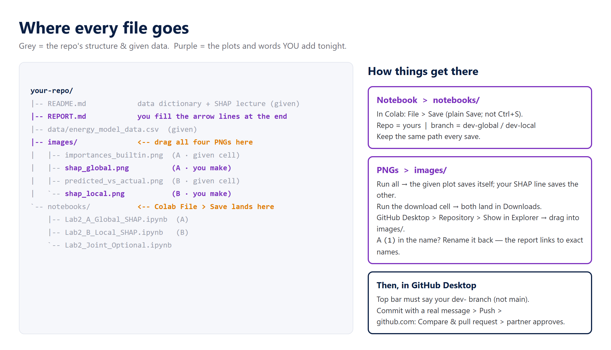

# Lab 2 instructions — Explaining a Model with SHAP (OPIM 5512)

**Module 2 · keep this open during the lab.** Every click you need tonight, in order.
The model is already trained. Tonight is about **explaining** it — and doing it through the
**GitHub workflow** you know: branch → commit → push → pull request → review → merge.

> 📖 **Read [SHAP_LECTURE.md](SHAP_LECTURE.md) first** (or follow along live). Your only coding task is **one SHAP line.** Type it.



---

## Before we start — check three things

1. **GitHub Desktop opens and you're signed in.**
2. **colab.research.google.com opens** and you're signed into a Google account.
3. You remember the Lab 1 loop. Same moves tonight; only the plots change.

**Pick roles:** Partner A owns **global** (what drives the model overall). Partner B owns **local**
(why one specific prediction). You explain the *same* model two ways, then merge.

---

# Part 1 — Set up the shared repo (Partner A drives, ~10 min)

### 1.1 Make the repo from the template
Open **https://github.com/drdave-teaching/opim5512-lab2-template** → green **Use this template** → **Create a new repository**.

| Field | What to put |
|---|---|
| Owner | **you** (your personal account) |
| Repository name | `opim5512-lab2-<netidA>-<netidB>` |
| Visibility | **Public** (the notebooks read the data over a raw link; nothing secret) |

Click **Create repository.** You now have a repo with the data, both notebooks, an empty `images/`,
a README with the data dictionary, and a `REPORT.md` skeleton. **You built none of it.**

### 1.2 Add your partner
Repo **Settings → Collaborators → Add people** → Partner B's GitHub username → **Add**.
**Partner B:** accept the invite (email, or the 🔔 on github.com). Until you accept, you can't push.

### 1.3 Protect `main`
Repo **Settings → Rules → Rulesets → New ruleset → New branch ruleset**:
- Name: `protect main` · Enforcement: **Active**
- Target branches → **Add target → Include default branch**
- Rules: ✅ **Require a pull request before merging** → **Required approvals: 1** → **Create**

The two-person gate: nothing lands on `main` without your partner's approval, and **you can't approve your own PR.**
*(Rehearsing solo with one account? Set Required approvals to **0**.)*

### 1.4 Both partners: clone it — once
**GitHub Desktop → File → Clone repository → GitHub.com tab** → find the repo (🔄 refresh if needed) → note the **Local path** → **Clone**.

> This is the *only* clone. From here, **Pull** brings work down, **Push** sends yours up.
> The **Changes** panel shows *what changed*; to see the files, use **Repository → Show in Explorer**.

### 1.5 Each partner: make your branch
**Current branch → New branch** → **`dev-global`** (A) / **`dev-local`** (B) → **Create branch** → **Publish branch**.

> 🔴 Read the top bar before every commit. If it says **`main`**, stop and switch.

---

# Part 2 — Explain the model (each partner, on your own branch, ~30 min)

### 2.1 Open *your* notebook in Colab, from *your* repo
**colab.research.google.com → File → Open notebook → GitHub tab** → paste your repo URL → open
`notebooks/Lab2_A_Global_SHAP.ipynb` (A) or `notebooks/Lab2_B_Local_SHAP.ipynb` (B). Open in its **own tab.**

### 2.2 Run the setup (given)
**Runtime → Run all.** The first cell runs `!pip install shap`, loads the data, and fits the model
(prints **R²** — that's how good it is). The SHAP setup cell then builds `shap_values` — one push in MW
per feature, per row. **You didn't write any of that; you're about to *use* it.**

You also get one plot for free:
- **Partner A:** the model's **built-in importances** bar chart → saves `importances_builtin.png`.
- **Partner B:** the **predicted-vs-actual** scatter → saves `predicted_vs_actual.png`.

### 2.3 Write your one SHAP line (the thing you code)
In the **TODO** cell, the exact shape is printed right above it.

**Partner A — the beeswarm (global):**
```python
shap.plots.beeswarm(shap_values, show=False)
plt.gcf().savefig("shap_global.png", dpi=150, bbox_inches="tight"); plt.close()
```
Then **look at it:** which feature is #1? Do high (red) values push demand up or down? Did SHAP reorder
the built-in ranking?

**Partner B — the waterfall (local):**
```python
i = int(np.argmax(model.predict(X)))          # the hour the model predicts highest
print("explaining:", df.loc[i, "hour"], "| actual:", round(df.loc[i,"load_mw"]), "MW")
shap.plots.waterfall(shap_values[i], show=False)
plt.gcf().savefig("shap_local.png", dpi=150, bbox_inches="tight"); plt.close()
```
Then **look at it:** which features pushed this hour **up** (red) and which pulled it **down** (blue)?
Hour of day, weather, or both? That sentence is your finding.

> Keep the filenames **exactly** as given — `REPORT.md` links to them.

### 2.4 Download your two PNGs
Run the **download** cell. Two files land in **Downloads**. If one "isn't found yet," run the cell that
makes it, then re-run.

### 2.5 Save the notebook back to GitHub (File → Save)
Colab **File → Save.** (No "Save a copy in GitHub" item — plain **Save** commits because you opened it
*from* GitHub. **Ctrl+S alone only autosaves to Drive.**) In the dialog:
1. **Repository** — scroll to **your** repo (long list, not searchable).
2. **Branch** — your `dev-` branch.
3. **File path** — leave it as `notebooks/Lab2_A_Global_SHAP.ipynb` (or `…B_Local…`). **Same path every time.**
4. **Commit message** — a real one: `add global SHAP beeswarm` / `add local SHAP waterfall`.

> 💡 Each save is a snapshot. Edit again → save again.

### 2.6 Drag the PNGs into the repo
**GitHub Desktop → Repository → Show in Explorer** → drag both PNGs from **Downloads** into **`images/`**.

> ⚠️ A `(1)` in a filename means you downloaded twice — **rename it back** to the exact name first.

### 2.7 Commit and push
Back in **GitHub Desktop**: confirm the top bar says **your `dev-` branch**. **Summary** = `add global SHAP plots`
(or `add local SHAP plots`) → **Commit** → **Push origin**. If it says **Pull origin** first (your Colab
save coming down), click that, then Push.

---

# Part 3 — Review & merge (both, ~20 min)

### 3.1 Open your pull request
github.com shows a yellow bar: **Compare & pull request** → check it's **`dev-global` → `main`** (or `dev-local`) →
title it → **Create pull request** → **Reviewers** → your partner.

### 3.2 Review your partner's
Open your **partner's** PR → **Files changed.** Read their SHAP cell and look at the PNG. Does the plot
answer their question — global "what matters," local "why this hour"? **Review changes → Approve → Submit review.**
Leave one real comment.

### 3.3 Merge, delete, pull
- **Merge pull request → Confirm → Delete branch.** Both PRs.
- **Both:** GitHub Desktop → **Current branch → main → Fetch origin → Pull origin.** Open `images/`: **four PNGs** —
  the global view and the local view of the same model, side by side.

---

# Part 4 — The report (one screen, two people, ~20 min)

### 4.1 Fill in `REPORT.md`
github.com → **`REPORT.md`** → ✏️ **Edit.** The four plots already render. Replace each **➜** line with **one
sentence** — every number gets a unit (MW, °F, hour). The key sentence to nail: **does global SHAP and the
local hour tell the *same* story about what drives demand?** Add one honest line under *What SHAP can't tell us*
(hint: SHAP explains **the model**, not physical cause).

### 4.2 It goes through a pull request too
**Commit changes…** → **Create a new branch** `report` → **Propose changes** → **Create pull request** → the
*other* partner **approves** → **Merge** → delete branch. `main` is protected — that's the rule working.

### 4.3 If you're ahead: the dependence plot
Open `notebooks/Lab2_Joint_Optional.ipynb` → run → download `shap_dependence.png` → drag into `images/` →
commit on a branch → PR → merge. It drops into section 5. Chase the question at the bottom of that notebook.

### 4.4 Read-out
Two plots on the screen — **beeswarm** (what the model leans on) and **waterfall** (why one hour) — one
sentence each. Then **Insights → Network** shows the loop going both ways.

---

## When it breaks

| Symptom | Fix |
|---|---|
| `No module named 'shap'` | The setup cell installs it. **Runtime → Run all** from the top; don't skip cell 1. |
| Beeswarm/waterfall cell errors on `shap_values` | You skipped the SHAP setup cell. Run all from the top. |
| Push rejected on `main` | You're on `main`. Switch to your `dev-` branch and commit there — the rejection is the protection working. |
| "Where's *Save a copy in GitHub*?" | It doesn't exist. Plain **File → Save**. |
| Saved but GitHub didn't change | You hit Ctrl+S (Drive autosave). **File → Save**, and re-save after each edit. |
| Report shows a broken image | Filename mismatch — usually a `(1)` in the PNG name, or it's in the wrong folder. Exact name, in `images/`. |
| Can't pick my branch in the Colab save dialog | It lists only *existing* branches. Make it in GitHub Desktop first (1.5), then save. |

*Never used this workflow? The Lab 1 kit walks every GitHub move slowly: [Lab1_FirstCommit](../../../Module1/Week1_TechStack/Lab1_FirstCommit/START_HERE.md).*
